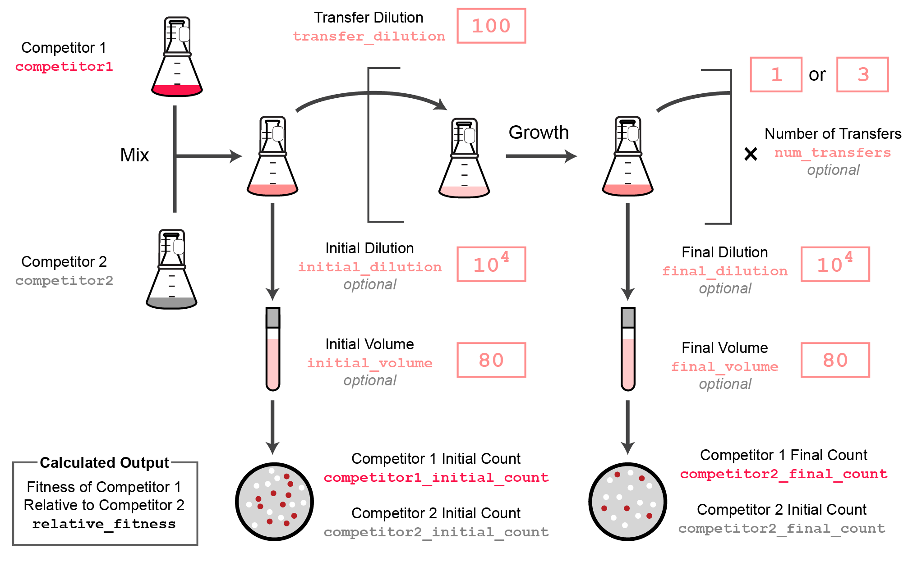

```{r, include = FALSE}
knitr::opts_chunk$set(
  collapse = F,
  comment = "#>",
  fig.width = 7
)
```

This R package is for calculating the relative fitness of two cell types from competition assays. Parameters of the competition procedure and counts of each cell type before and after they are co-cultured are input. This vignette demonstrates how to analyze and plot some example competition assay data.

```{r setup, message=FALSE}
library(fitnessR)
library(tidyverse)
```

We'll begin by taking a look at one of the example datasets built into the `fitnessR` package. This dataset is from competitions of populations of cells that evolved for 40,000, 50,000, or 60,000 generations in the Long-Term Evolution Experiment with _E. coli_ (LTEE) versus two different reference strains of _E. coli_ [Lenski et al. 2015](https://royalsocietypublishing.org/doi/10.1098/rspb.2015.2292).

The standard LTEE competition experiment design and how to set the fitnessR parameters (columns in the input data frame) to match it are shown in this figure 

```{r, out.width = "100%", echo=FALSE}

```

The example competitions were conducted as is typical for LTEE samples, with a 100-fold dilution each day, and $10^4$ initial and final dilutions of the samples for plating. They were conducted over 3 transfers (days in competition). Only 50 µl of the initial and final dilutions was plates, versus the normal 80 µl used in LTEE competitions, so that there were fewer total colonies to count.

The input data frame looks like this.

```{r}
head(LTEE_40K_to_60K_competitions)
```

Since the initial and final dilutions and plating volumes are equal, they could be left out of the data frame and fitnessR would calculate the same relative fitness values, but they are provided here for clarity.

The dataset contains competition counts from 9 different LTEE populations:

```{r echo=FALSE}
unique(LTEE_40K_to_60K_competitions$competitor2)
```

...and across three different time points:

```{r, echo=FALSE}
unique(LTEE_40K_to_60K_competitions$generation)
```

Competitions were performed against two different reference strains:

```{r, echo=FALSE}
unique(LTEE_40K_to_60K_competitions$competitor1)
```

To demonstrate performing relative fitness calculations using `fitnessR`, we'll narrow this data frame down to one population at one time point versus one reference strain and drop some of the columns with unnecessary information.

```{r}
ara_p1_50k <- LTEE_40K_to_60K_competitions %>% 
  filter(competitor2 == 'Ara+1', generation == 50000, competitor1 == "REL10948") %>% 
  select(!c('flask','date','replicate','person'))
head(ara_p1_50k)
```

The fitness value of this population at this time point relative to its reference strain competitor, REL10948, can be calculated using the `calculate_fitness()` function in the `fitnessR` package. If the columns of the data frame are already named *"competitor1_initial_count"*, *"competitor1_final_count"*, *"competitor2_initial_count"*, and  *"competitor2_final_count"*, like they are in this data frame, then all you have to do is hand the data frame to the function. It will return a text box with an explanation regarding the calculation along with your original data frame with a `relative_fitness` column added to it.

```{r}
head(calculate_fitness(ara_p1_50k))
```

The text box output can be dropped using the `silent = TRUE` option as an input. 

Next, we'll use the output to graph our result along with the mean relative fitness and the 95% confidence intervals for all 9 of the populations at the 50K generation mark versus this reference strain. We'll also include a line at a relative fitness value of 1. Populations above the line are more fit than the reference strain and those below the line are less fit than the reference strain.

```{r plotting}
fitness_50k <- LTEE_40K_to_60K_competitions %>% 
  filter(generation == 50000) %>%
  calculate_fitness(silent = T)

fitness_50k_summary <- fitness_50k %>% group_by(competitor2) %>%
  summarize(mean_fitness = mean(relative_fitness),
            upper = mean(relative_fitness, na.rm = T) + 
                       qt(0.975, df = n() - 1) * sd(relative_fitness, na.rm = T)/sqrt(n()),
            lower = mean(relative_fitness, na.rm = T) - 
                       qt(0.975, df = n() - 1) * sd(relative_fitness, na.rm = T)/sqrt(n()))

ggplot(fitness_50k_summary, aes(x = competitor2, y = mean_fitness)) + 
  geom_point() +
  geom_errorbar(aes(ymin = lower, ymax = upper)) +
  geom_hline(yintercept = 1)
```

If you wish to save the individual replicate data you can run `write_csv(fitness_50k, "fitness_50k.csv")` and if you want only the summary values you can run `write_csv(fitness_50k_summary, "fitness_50k_summary.csv")`.

This package also conveniently contains a template for you to fill in with your own count data so that it's already formatted properly to work well with these functions.

```{r}
head(competition_template)
```

If you wish to use this template for your data, run `write_csv(competition_template, "count_data.csv")` and then enter in your data over the bracketed information. The template does include instructions and examples at the bottom. You can leave those comments as longs as you use `read_csv(count_data.csv, comment = "#")` to load the data. Once you've loaded your data filled file into your current R environment, you should be able to use the `calculate_fitness()` function on the dataset without having to provide any additional parameters.
